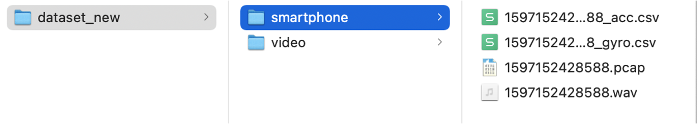
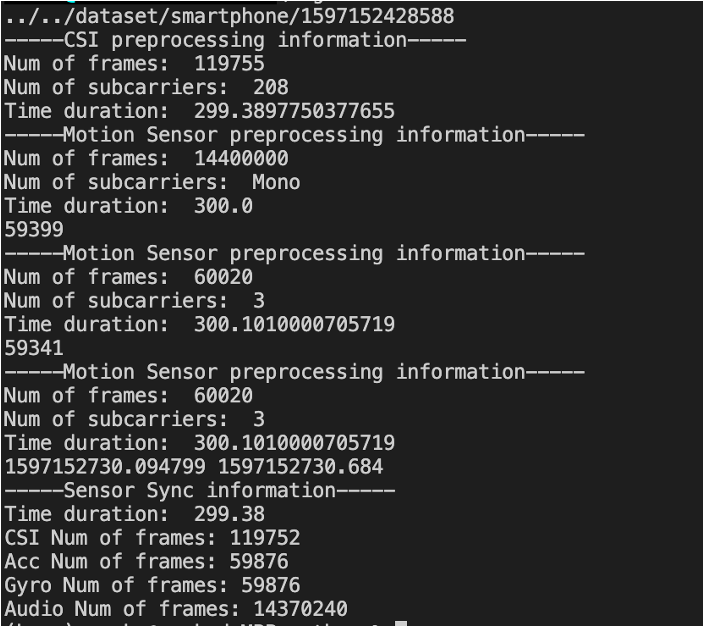

# EgoADL: Multimodal Daily-life Logging in Free-living Environments Using Non-visual Sensors on Egocentric Smartphone Supplementary Materials

EgoADL is the first egocentric ADL sensing system that uses an in-pocket smartphone as a multi-modal sensor hub to capture body motion, interaction with the physical environment and daily objects using non-visual sensors.
Specifically, we collect three modalities, i.e., audio recording, motion sensor and Wi-Fi Channel State Information (CSI) from a single in-pocket smartphone.

In this repo we will opensource

- [Data collection](#data-collection-tool): Android App along with the instructions to install the Nexmon CSI Tool and App, and How to use it.

- [Data preprocessing](#data-preprocessing)

- [Data annotation](#data-annotation-tool): Application from [Action-annotation](https://github.com/devyhia/action-annotation) and how we use it.

- [Data cleaning and segmentation](#data-cleaning-and-segmentation): segment and clean both the data and annotation labels.

- [Deep learning algorithm](#mmfwsf), i.e.,  Multi-Modal Frame-Wise Slow-Fast (MMFWSF) transformer [[1]](#1).

- Dataset: https://doi.org/10.5281/zenodo.8248159 

## Data collection
Our data collection tool is an Android APP that can be easily install on Android smartphone, which collect audio recording, motion sensor and Wi-Fi CSI. Please refer to ```/data-collection``` for the code of Android APP ```EgoMotion```.

### Prerequisite

Our Wi-Fi CSI data collection relies on [Nexmon CSI](https://github.com/seemoo-lab/nexmon_csi), which allows us to extract channel state information (CSI) of OFDM-modulated Wi-Fi frames (802.11a/(g)/n/ac) on a per frame basis with up to 80 MHz bandwidth on the Broadcom Wi-Fi Chips and smartphone [[2]](#2). Thus, only few Broadcom Wi-Fi Chips and smartphone support it, including Nexus 5 and Nexus 6P. In our data collection, we use Nexus 5 as our test platform.

Before installing our data collection Android APP, please first follow [the instruction in Nexmon CSI](https://github.com/seemoo-lab/nexmon_csi#getting-started) to build and compile all the firmware patches required to extract CSI. Note that you need to build and compile the firmware patches corresponding to your smartphone and firmware version! Please also try the [usage](https://github.com/seemoo-lab/nexmon_csi#usage) to make sure that the firmware patches has been compiled and installed correctly.

### Installation

Then, you can follow the steps to install our Android APP, which will directly run the command to collect the audio recording, motion sensor and Wi-Fi CSI from a specific Wi-Fi router using 802.11 ac.

1. Run 
[```utils/makecsiparams/makecsiparams```](https://github.com/seemoo-lab/nexmon_csi/tree/master/utils/makecsiparams) locally to generate a base64 encoded parameter string that can be used to configure the extractor. You need to configure the bandwidth, nssmask, source mac address (i.e., The Wi-Fi router that will transmit the packet during the data collection), etc.

2. Hard code the base64 encoded parameter (without the frist 2 character) to the ```spec''' string in "MainActivity.java" in the Android APP
```
String spec = channel_str +  "IBEQAAAQCA8+811Z4AAAAAAAAAAAAAAAAAAAAAAAAAAA==";    
sudoForResult("nexutil -Iwlan0 -s500 -b -l34 -v" + spec);
```
The first 2 character represents to the Wi-Fi channel, which can be directly controlled by our APP.

3. Install the APP to the corresponding smartphone, e.g., Nexus 5.

### Data Collection Setup

You will need 3 devices:
1. Laptop, which is used to transmit and receive Wi-Fi packets from Wi-Fi router, can be Linux or MacOS.
2. WiFi router. Our test device is ASUS RT-AC86U.
3. Smartphone. Our test device is Nexus 5.
4. Head-mounted GoPro. Optional for groud truth annotation.

Then, we need to setup the Wi-Fi link between the laptop and Wi-Fi router.

1. Connect the Wi-Fi router to the power, and connect the Laptop with Wi-Fi router using SSID.
2. Check the configuration of current WiFi signals by navigate to Wi-Fi configuration page. For example, ```router.asus.com``` for ASUS router. Check sure the following configuration:

    - Wireless Mode: AC or N/AC mixed
    - Channel bandwidth: 80 MHz
    - Control Channel: we can choose the channel from the following 4 options ```36```, ```52```, ```100```, ```149``` (North American only)

Here is an example from ASUS router configuration page:


The reason why we can only choose the channel from ```36```, ```52```, ```100```, ```149``` is that we are using the Wi-Fi Channels on the 5 GHz band with 80 MHz bandwidth as show in the following figure.


After set all the configure of Wi-Fi router, please restart the Wi-Fi router, connect the laptop with the router, and check the Wi-Fi connection from the laptop side. Here is an example check by using a Macbook Pro.


We will use ```ping``` command to create a stable Wi-Fi traffic between Laptop and Wi-Fi router.
For example, to transmit and receive 400 packets per second, we use the command 
```
sudo ping -i 0.0025 192.168.50.1
```
on Linux and MacOS.

On the smartphone side, you need to install EgoMotion APP and then you will see the following UI


- Recording Time Duration: the duration for a single data collection session (unit: second)

- Recording Number: number of sessions for data collection

- Channel: Wi-Fi channel, **which needs to be exactly the same as the Wi-Fi router and laptop**.

On the head-mounted GoPro side, make sure it can record both audio and video and save in the SD card.

### Data Collection Procedure 

1. Make sure that all the devices have been set up correctly.
2. Create a stable Wi-Fi traffic between Laptop and Wi-Fi router by using ```ping```.
3. On the smartphone side, open the app, set the configuration, and click ```CHECK``` button.

4. If it shows that "WiFi CSI data collecting testing pass" and the ```DATA COLLECTING``` button is enabled, then it means everything has been set up correctly.
5. Start the GoPro recording
6. Click the ```DATA COLLECTING``` button on the smartphone, and then put smartphone into your pocket.
7. When you hear the reminder sound from the smartphone, it means that this session data collection has finished and please stop the GoPro recording.
8. Get the smartphone out of your pocket, wait for the ```DATA COLLECTING``` being enabled (the APP is saving the motion sensor, audio recording and Wi-Fi CSI recoding to the storage, which typically needs 30 s for a 300 s session. Please do not terminate the APP in this period.).
9. Finally, you will see the following UI after each session


The packet number means the overall Wi-Fi packets received by Nexmon CSI. Ideally, the packet number will be close to $$\text{packets per second} \times \text{seconds for each session}$$.
In this example, "packets per second" is controlled by ```ping``` command, which is $$\frac{1}{0.0025} = 400$$ and "seconds for each session" is determined by APP configuration "Recording Time Duration", which is 30.
Therefore, the ideal received "Packet Number" is $$30 * 400 = 12000$$

In this example, we received ```12210``` instead because the smartphone will be the monitor mode and capture all the packets transmitted by Wi-Fi router. However, if the received packets is extremely smaller than the ```12000```, this means that the Wi-Fi link between laptop and Wi-Fi router is not stable and the Wi-Fi CSI may miss some data.

After data collection, the data from the smartphone are saved in the SD storage ```/Download```.
There are 4 files

1. ```[timestamp]_acc.csv```: accelerometer data csv
2. ```[timestamp]_gyro.csv```: gyroscope data csv
3. ```[timestamp].pcap```: Wi-Fi data pcap
4. ```[timestamp].wav```: audio recording wav

where ```[timestamp]``` is the data collection timestamp (```System.currentTimeMillis()```) on the smartphone.
 

## Data preprocessing

Please refer to ```/preprocessing/python``` to check our preprocessing code.
Here is the overview of our data preprocessing pipeline.


Here are the python packages that we need for our preprocessing [requirements.txt](./preprocessing/python/requirements.txt).
```
numpy==1.20.3
CSIKit==2.3
matplotlib==3.4.2
scipy==1.6.3
moviepy==1.0.3
```

First, we will preprocess each modality from the smartphone separately.

### Wi-Fi CSI
- Wi-Fi CSI amplitude with 208 channels and 400 Hz sampling rate.

We use [CSIKit](https://github.com/Gi-z/CSIKit) to extract the CSI amplitude from ```pcap``` file.
In the preprocess pipeline, we will first extract data frame CSI (802.11 ac packets with 80 MHz bandwidth). Then, we remove the subcarriers without CSI and left 208 usable subcarriers. Third, we compensate the AGC by using a max-min calibration method. Fourth, we resample the Wi-Fi CSI amplitude to 400 Hz sampling rate.

### Motion Sensor
- Acceleromter, 3 Channels, 200 Hz sampling rate
- Gyroscope, 3 Channels, 200 Hz sampling rate

Since the sampling interval for both acceleromter and gyroscope is not stable, we will resample them to 200 Hz sampling rate.

### Audio recording
- Audio, mono channel, 48 kHz.


### Preprocessing pipeline usage

1. Organize the dataset as follows:



2. Rename the video file to the smartphone data file by running 
```
python ./preprocessing/python/rename_dataset.py -p filepath
```
where ```filepath``` is the filepath of the ```dataset_new```.

3. Preprocess the data, Compress the video (It may take about 5 min for each 5 min data because of video compression.)
```
python ./preprocessing/python/preprocess.py -p filepath
```
where ```filepath``` is the filepath of the ```dataset```. Note that we need to compress the video since the origanl video recorded by GoPro is large. Here is the screenshot for our data preporcessing.




The outputs of the preprocess are an ```[timestamp].npz``` file in the ```smartphone``` folder and a ```MP4``` file with smaller size in the ```video``` folder.

## Data annotation
If you need to annotate the non-visual, you will need to use a data annotation tool to anotate the human behaviors based on the egocentric video from the GoPro.

### Data annotation tool
We use the [Action-annotation](https://github.com/devyhia/action-annotation) for our data annotation.
Please first install it locally.

We provide a set of predefined label with json format (```/annotation/label.aucvl```) from egocentric vision dataset from Charades dataset [[3]](#3), hand activity recognition paper [[4]](#4). 

We did some modification on the front-end of original [Action-annotation](https://github.com/devyhia/action-annotation). Please replace ```/annotation/index.html``` in our repo to ```/app/index.html```

### Data annotation process
Once you installed the [Action-annotation](https://github.com/devyhia/action-annotation), you will see the following UI


Please choose ```or Existing Project``` and import the ```/annotation/label.aucvl```. And then, you can add the videos that need to be annotated via ```Add Videos``` button. You can also write your own script to add the videos into ```/annotation/label.aucvl``` automatically.

Then, you can annotate the video based on the following instructions:

1. Annotate each behavior at the **beginning** of it.
2. Annotate it as detail as possible. Try to first use the labels provided by our tool. If you can not find a label in our tool, you can also add a label by using the right column “labels” (scrolling down the list).
3. Label the ```end``` when you hear the reminder sound of the smartphone
4. Make ```complete``` for the labelled data

The following the Figure shows the process of annotation. We use Typeahead to quickly type and select from a list of matching labels.


Note that, in this step, we only annotate the video based on the video timestamp. We also need to synchronize the timestamp with the egocentric smartphone data. As show in [Sec. Data preprocessing](#data-preprocessing), we use the audio recording from smartphone and the GoPro to achieve such time synchronization.
We provide a script ```/anontation/syn.py``` to check the data and synchronization the label with egocentric smartphone and video.
Specifically, it will check the dataset by the following steps.

1. Check Video Smartphone Dataset Number and Correspondence

2. Check Video Labels
    - All files labelled?
    - Any video is not loaded to the labelling tool?

3. Check Sampling Rate for each modality

4. Sync the labelled video data with smartphone data by using the ‘end’ label

5. Visualization

## Data cleaning and segmentation

### Data cleaning

We will clean the labels by generating the ```label_clean.aucvl``` from ```label_sync.aucvl``` using ```\dataclean\clean_label.py```.

We organize the dataset as follows:
```/dataset/userid```
- ```label```
    - ```label.aucvl```: the original annotation file
    - ```label_sync.aucvl```: the annotation file after synchronization
    - ```label_clean.aucvl```: the annotation file after synchronization and cleaning
- ```smartphone```
    each session will have 5 fives:
    - ```[timestamp]_acc.csv```
    - ```[timestamp]_gyro.csv```
    - ```[timestamp].pcap```
    - ```[timestamp].wav```
    - ```[timestamp].npz```
- ```video```
    - ```[timestamp].MP4```


### Data segmentation
We segment the data for each single human behavior by using script ```/dataseg/segment.py```.
After that we will recieve a ```csv``` file that contains all the annotation information of the dataset, including the following columns
- ```ID```: UUID 
- ```duration```: duration (unit:second)
- ```rate```: the ratio of the data that has effective Wi-Fi CSI
- ```npz```: npz file path
- ```semantics```: activities
- ```npz path```: npz file path of the session
- ```starttime```: start time of the human behavior in that session

## MMFWSF

The training and testing code is in ```/MMFWSF```. We use the [speechbrain](https://speechbrain.github.io/) as the template for EgoADL. Please check how to use it in [speechbrain](https://speechbrain.github.io/).

## Reference

<a id="1">[1]</a> Multimodal Daily-life Logging in Free-living Environments Using Non-Visual Egocentric Sensors on a Smartphone. ACM IMWUT (UbiComp), 2024. 

<a id="2">[2]</a> Francesco Gringoli, Matthias Schulz, Jakob Link, Matthias Hollick.  Free your CSI: A channel state information extraction platform for modern Wi-Fi chipsets. ACM WiSec, 2019.

<a id="3">[3]</a> Hollywood in Homes: Crowdsourcing Data Collection for Activity Understanding. CVPR, 2016. 

<a id="4">[4]</a> Sensing Fine-Grained Hand Activity with Smartwatches, CHI, 2019

